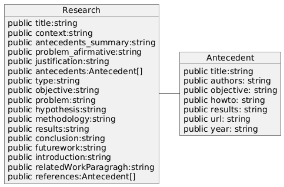
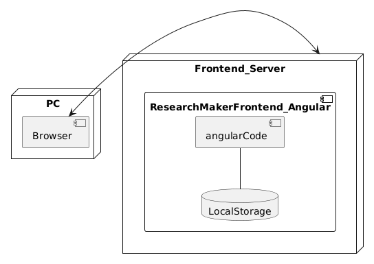

<h1 style="text-align:center;">MEMORIA DESCRIPTIVA   ResearchMaker</h1>

## CAMPO DE APLICACION

El sistema es una aplicacion que permite armar la estructura de una investigacion cientifica para novatos en la investigación. Esta aplicacion esta pensada para estudiantes de pregrado en las carreras de Informática y afines, donde se realiazan investigaciones aplicadas.

## ANTECEDENTES DEL SOFTWARE

Muchos estudiantes de pregrado se encuentrado con el dilema de la generacion de sus proyectos de tesis o la ejecución de esta. Por tanto, cuando un estudiante ya tiene la idea de sus investigación, esta aplicación le ayuda a usar una estructura de su documento que le permitirá olvidarse de la estructura y concnetrarse pensar en las iniciativas para realizar la investigación.

## OBJETIVOS DEL SOFTWARE

Guiar en la elaboracion del proyecto de tesis o de un artículo cientifico.

## FUNCIONALIDAD DEL SOFTWARE

* Sincronizacion Objetivo, Problema, Hipotesis.- Permite al definir un objetivo, auto sugerir el problema y la hipotesis en caso la investigación tenga hipotesis.

* Definición de la introducción.- Mediante partes claves e identificadas el usuario llena estas partes y la aplicación genera el borrador de la introducción.

* Tabla de Antecedentes.-  Permite evidenciar el analisis de los atecedentes, asi como elaborar la redacción de los antecedentes del estudio.

* Metodologia y ejecuión de la investigación.-  Si el usuario considera tambien puede narrar las secciones de Metodologia, Resultados, Conclusiones y trabajos futuros.

* Exportar a PDF.- Permite al usuario, generar un documento en formato PDF con todo el contenido de los ingresados.

* Compartir.- Permite al usuario, mediante un enlace, copiar y compartir el documento a otros usuarios. 

* Cambios de modo de visualización.- Permite al usuario, visualizar tanto el modo Edicion, como el modo vista previa.

## ESTRUCTURA DEL SOFTWARE

El sistema utiliza tecnologia de software libre basada informacion en JSON. Esta creado con el framework Angular 18. Utiliza una almacenamiento local del navegador. Los requirimientos minimos para el funcionamiento del servidor con el sistema son:

* Computador con mínimo 4GB de RAM.
* Espacio destinado en disco duro promedio de 200MB.
* Corre en sistemas operativos Linux Ubuntu, CentOS, RedHat siempre que cuente con un navegador web.

El software está preparado para funcionar en cualquier dispositivo, pc, mobile, tabletas siempre y cuando se cuente con internet en el dispositivo. Al ser una aplicacion Frontend, no cuenta con una base de datos compleja, sin embargo se registran en los almacenamientos del navegador los siguientes datos:

El sistema tiene un despliegue que se basa en el siguiente diagrama:

Para desarrollo, debe usar el comando "npm install" para las dependencias y  debe correr ng serve. Para correr la aplicación en producción, Debe esta desplegado en un sistema CDN como cloudflare u otros parecidos.

Para desplegar en github pages usa el las librerias gh-pages: ng deploy --base-href=/secondarystudy-maker/
