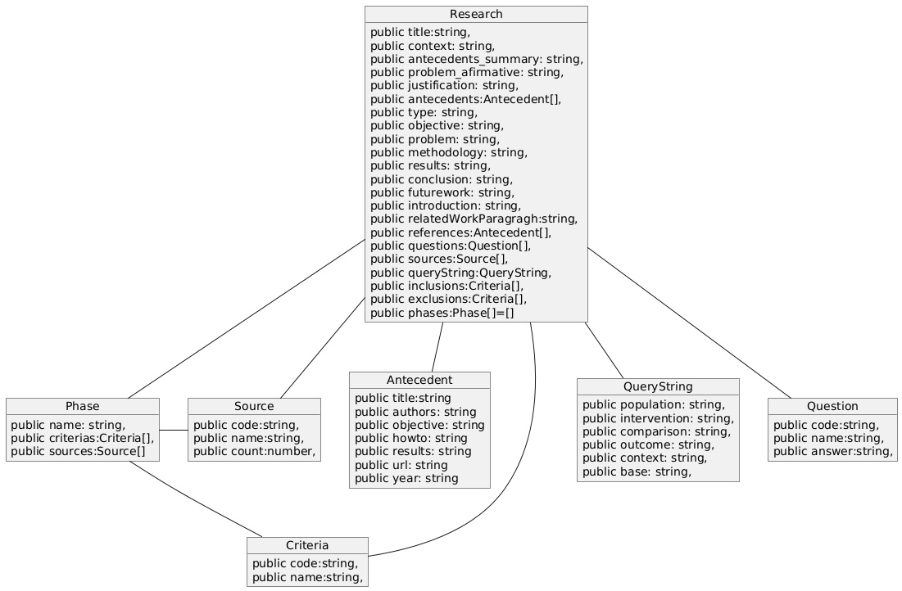
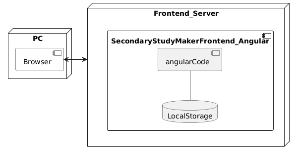

<h1 style="text-align:center;">MEMORIA DESCRIPTIVA <br /> Secondary-Study-Maker</h1>

## CAMPO DE APLICACION

<p style="text-align:justify;">El sistema es una aplicacion que permite armar la estructura de una investigacion cientifica de tipo estudio secundario para novatos en la investigación. Esta aplicacion esta pensada para estudiantes de pregrado en las carreras de Informática y afines, donde se realizan estudios secundarios de tipo Mapeo Sistemático de Literatura o Revisión Sistemática de Literatura.</p>

## ANTECEDENTES DEL SOFTWARE

<p style="text-align:justify;">Muchos estudiantes de pregrado se encuentran con el dilema de la generación del estado de arte de un tema para investigación. Por tanto, esta aplicación le ayuda a usar una estructura de su documento que le permitirá olvidarse de la estructura y concnetrarse pensar en las iniciativas para realizar el estudio secundario.</p>

## OBJETIVOS DEL SOFTWARE
<p style="text-align:justify;">Guiar en la elaboracion de un estudio secundario usando la tecnica de mapeo o de revisión sistemática de literatura.</p>

## FUNCIONALIDAD DEL SOFTWARE
<p style="text-align:justify;">


* Definición de la introducción.- Mediante partes claves e identificadas el usuario llena estas partes y la aplicación genera el borrador de la introducción.

* Tabla de Antecedentes.-  Permite evidenciar el analisis de los atecedentes, asi como elaborar la redacción de los antecedentes del estudio.

* Metodologia y ejecuión de la investigación.-  El usuario debe llenar las preguntas de investigación cadena de busqueda, fuentes de datos y la aplicacion de criterios de inclusión y exclusión.

* Exportar a PDF o Word.- Permite al usuario, generar un documento en formato PDF o Word con todo el contenido del estudio.


* Cambios de modo de visualización.- Permite al usuario, visualizar tanto el modo Edicion, como el modo vista previa.
</p>

## ESTRUCTURA DEL SOFTWARE
<p style="text-align:justify;">El sistema utiliza tecnologia de software libre basada informacion en JSON. Esta creado con el framework Angular 18. Utiliza una almacenamiento local del navegador. Los requirimientos minimos para el funcionamiento del servidor con el sistema son:</p>

* Computador con mínimo 4GB de RAM.
* Espacio destinado en disco duro promedio de 200MB.
* Corre en sistemas operativos Linux Ubuntu, CentOS, RedHat siempre que cuente con un navegador web.

<p style="text-align:justify;">El software está preparado para funcionar en cualquier dispositivo, pc, mobile, tabletas siempre y cuando se cuente con internet en el dispositivo. Al ser una aplicacion Frontend, no cuenta con una base de datos compleja, sin embargo se registran en los almacenamientos del navegador los siguientes datos:</p>

<p style="text-align:center;">

</p>

<p style="text-align:justify;">
El sistema tiene un despliegue que se basa en el siguiente diagrama:
</p>

<p style="text-align:center">

</p>

<p style="text-align:justify;">Para desarrollo, debe usar el comando "npm install" para las dependencias y  debe correr "ng serve". </p>
<p>
Para correr la aplicación en producción, Debe esta desplegado en un sistema CDN como cloudflare u otros parecidos.</p>
<p>Para desplegar en github pages usa el las librerias gh-pages: </p>

```bash
ng deploy --base-href=/secondarystudy-maker/
```

<p style="text-align:justify;">Para esto, debe activar en la plataforma de github.com / Settings / Pages. El repo debe ser publico y debe asignar a la rama gh-pages como rama de despliegue, al ejecutar el comando anterior, se deplegara la pagina, al entrar al repo en la parte derecha puede ser los deslpliegues y la ruta de donde esta desplegado, por ejemplo https://academicp.github.io/secondarystudy-maker/</p>
