<h1 style="text-align:center">SecondaryStudyMaker  [Manual de Usuario]</h1>

 Version:1.0 | 05/10/24 | Brian Pando 

## Llenar el formulario.

Al ingresar a la aplicación, debe empezar a llenar los datos del formualario, tales comoo el titulo, objetivo, justificacion y demas campos del formulairo.

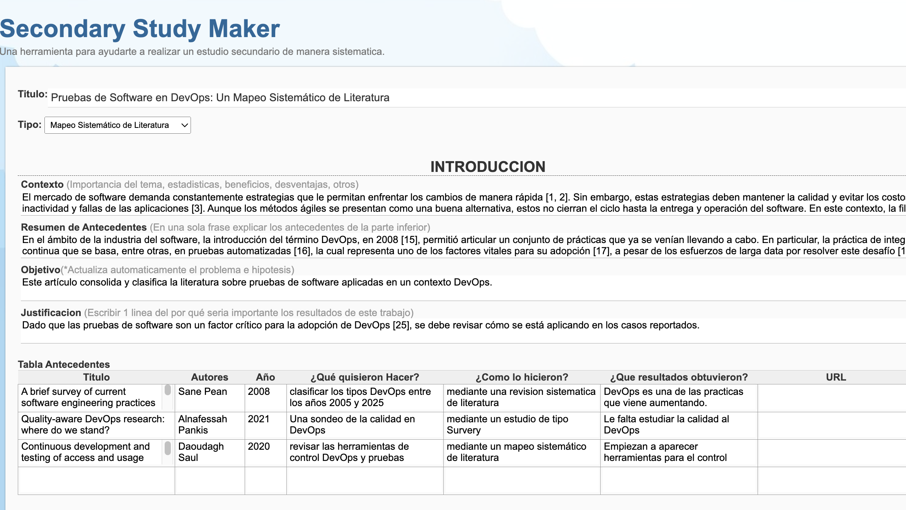

Lo cambios que vaya haciendo el formulario se iran guardado en modo local cada ciertos segundos, de manera que cuando usted vuelva a entrar a la aplicacion se mostrará los datos que ha venido registrando.

## Definición de la Introducción.

La introducción, esta compuesta por varas partes: el contexto, el problema, los antecedentes, la justificacion y las secciones que le siguen a continuación. Debe llenar estar partes para que la aplicacion le sugiera la introducción.

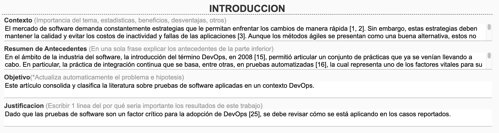

## Generacion de antecedentes.

La sección de antecedentes y trabajos relacionados, se elabora llenando la tabla de antecedentes, a partir de este formato la aplicación le sugiere un básica forma de redactar la sección antecedentes, luego puede resumir estas ideas combinandolas con las suyas.

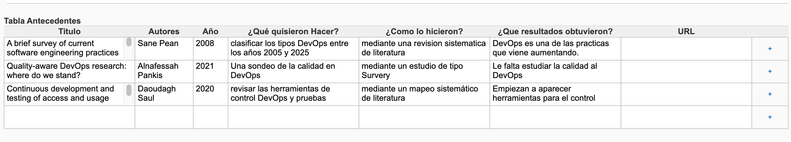

## Metodologia y ejecuión de la investigación.

En este tipo de estudio, la metodología se basa en las preguntas de investigación, la cadena busqueda, las fuentes de datos, los criterios de inclusion y exclusión, finalmente su aplicación en fases.

Las preguntas de investigación deben ser llenadas en esta parte, posteriormente seran respondidas en secciones abajo.

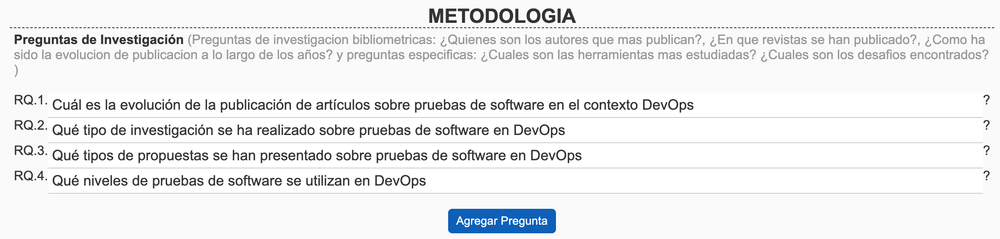

La cadena de busqueda debe ser resuelta mediante la tecnica PICOC, por lo que debe llenar este formulario para genera la cadena de busqueda base.

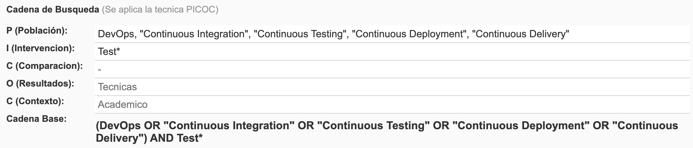

Aqui debe agregar la lista de fuentes de datos donde ejecutará las busquedas. Esta sección es importante para hacer los calculos en las etapas siguientes.

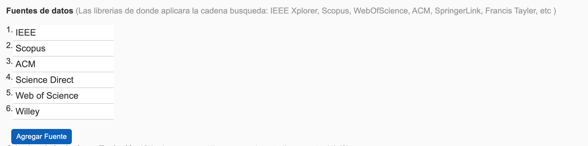

Los criterios de inclusión y exclusión son las condiciones que debe cumplir cada trabajo revisado para ser aceptado en la investigación.

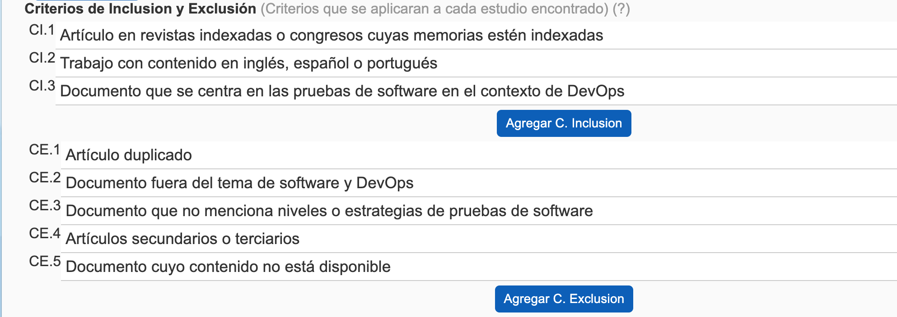

Las fases sirven para indicar la aplicación de los criterios de inclusión y exclusión por fases, en las cuales se van filtrando los trabajos que la investigación busca recolectar. Aqui se van anotando el numero de investigaciones que van quedando fase a fase.

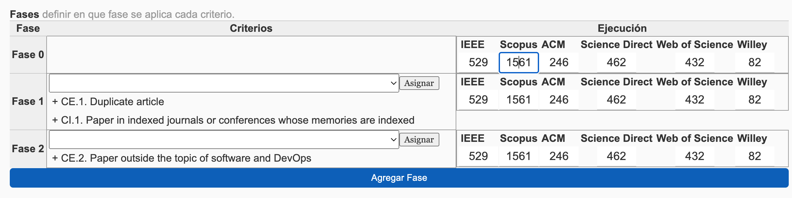

## Resultados y Discusiones

Los resultados en este tipo de investigación se explican respondiendo a cada pregunta de investigación, por tanto debe llenar las respuestas de cada una.

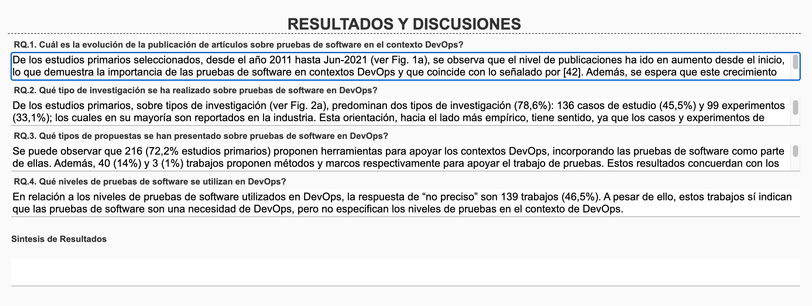

## Otros datos

También puede dar una idea de las conclusiones y trabajos futuros. Además, la aplicación le sugiere unas referencias tomadas de los trabajos relacionadas.

## Modo de Visualizacion.

El usuario puede verificar como se vera el documento en caso desee exportar el documento, para este el sistema tiene 2 modos de visualiaacion en la parte inferior, la de edicion (vista por defecto) y la de vista previa.

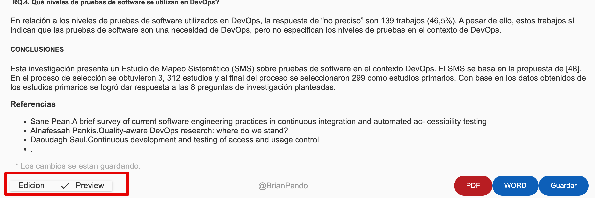

## Exportar a PDF o WORD.

Una vez terminado el trabajo, o completado parcialmente, el usuario puede exportar esta informacion en PDF o Docx, para ser compartida o presentada por el usuario, fuera de la aplicación.

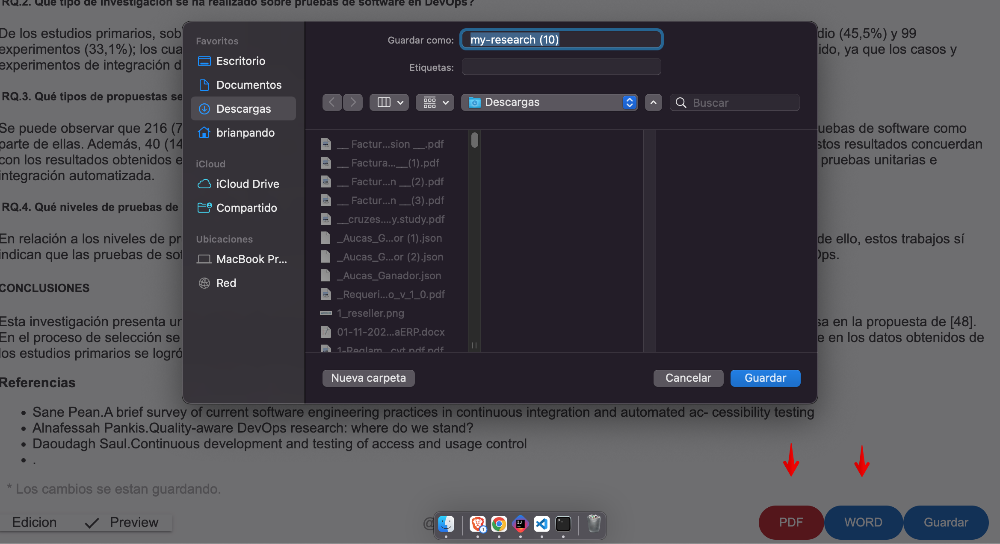

## Guardar.

También, puede guardar manualmente los avances, estos datos se quedaran guardadas para cuando se de el tiempo regresar a la aplicación.

FIN.-
