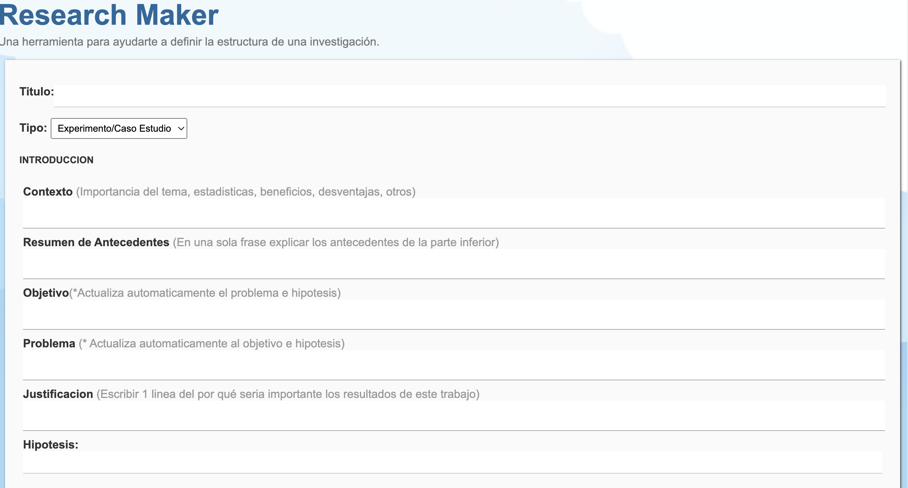
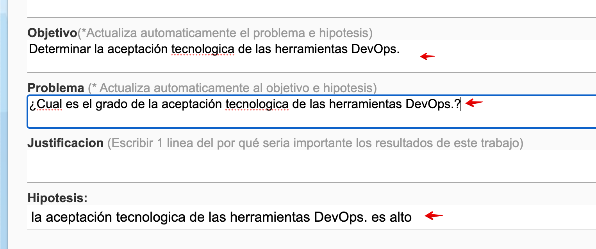
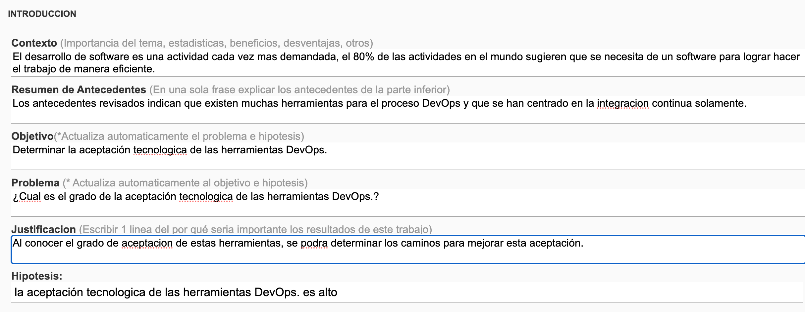
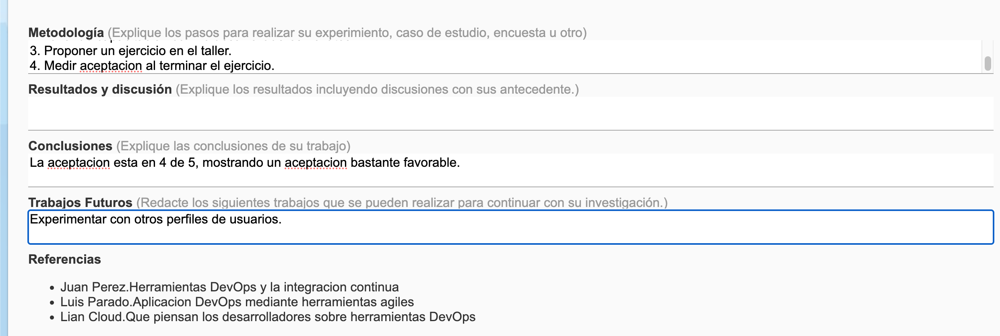
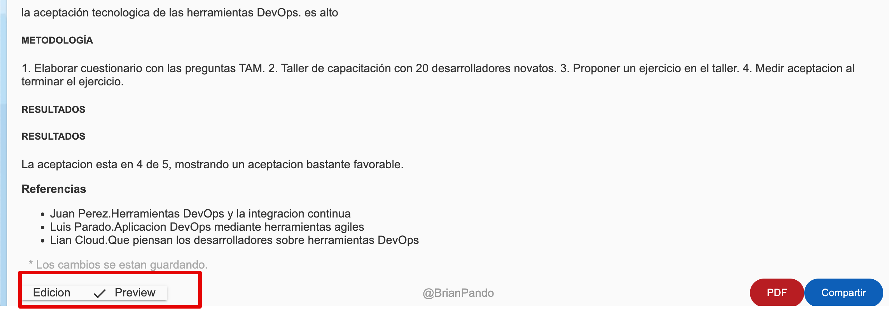
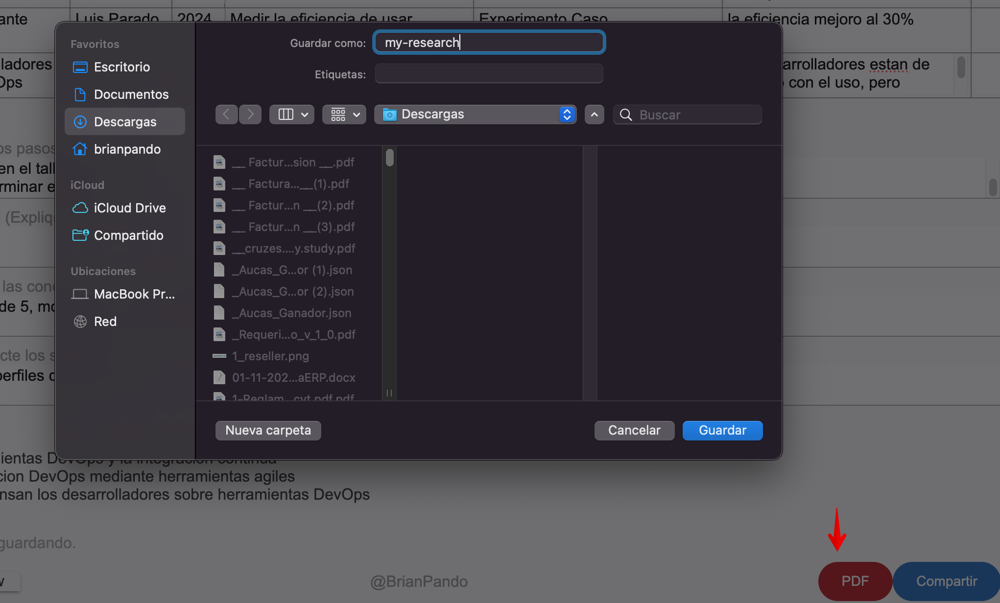
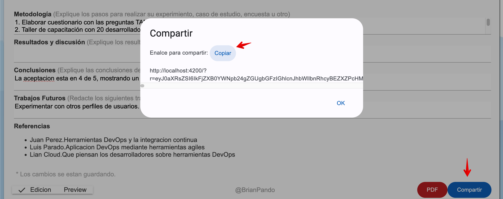

<h1 style="text-align:center">ResearchMaker  [Manual de Usuario]</h1>

 Version:1.0 | 22/07/24 | Brian Pando 

## Llenar el formulario.

Al ingresar a la aplicación, debe empezar a llenar los datos del formualario, tales comoo el titulo, objetivo, justificacion y demas campos del formulairo.

Lo cambios que vaya haciendo el formulario se iran guardado en modo local cada ciertos segundos, de manera que cuando usted vuelva a entrar a la aplicacion se mostrará los datos que ha venido registrando.

## Sincronizar objetivo, problema e hipotesis.

La idea de aplicación es ayudar a elaborar documentos sincronizados, por tanto, al escribir un objetivo como "Determinar la aceptacion tecnologica de las herrmientas para el proceso DEVOPS", se genera de forma automatica el problema: "¿Cual es el grado de aceptacion tecnologica de las herramientas para el proceso DeVOPS?", y la hipotesis "El grado de aceptación tecnologia de las herramientas para el proceso DevOps es alto."

De esta manera estos 3 componentes claves de una investigacion se mantinene sincronizadas, el mismo mencanimos funcionará si cambia el problema, se actualizará el objetivo y la hipotesis.

## Definición de la introducción.

La introducción, esta compuesta por varas partes: el contexto, el problema, los antecedentes, la justificacion y las secciones que le siguen a continuación. Debe llenar estar partes para que la aplicacion le sugiera la introducción.

## Generacion de antecedentes.

La seccion de antecedentes y trabajos relacionados, se elabora llenando la tabla de antecedentes, a partir de este formato la aplicación le sugiere un basica forma de redactar la seccion antecedentes, luego puede resumir estas ideas para usarlo en la troducción.

## Metodologia y ejecuión de la investigación.

Si el usuario prefiere, tambien puede llenar las demas partes de la investigación como guia para proyectarse a lo que le viene, por tanto puede llenar la metodología, los resultados, las conclusiones y trabajo futuro.

## Modo de Visualizacion.

El usuario puede verificar como se vera el documento en caso desee exportar el documento, para este el sistema tiene 2 modos de visualiaacion en la parte inferior, la de edicion (vista por defecto) y la de vista previa.

## Exportar a PDF.

Una vez terminado el trabajo, o completado parcialmente, el usuario puede exportar esta informacion en PDF para ser compartida o presentada por el usuario, fuera de la aplicación.

## Compartir.

El usuario tiene la posibilidad de compartir un enlace con otras personas y estas pueden ver el documento para revisarlo o para editar en su navegador de manera local, es decir, los cambios que pueda hacer otro usuario no afecta a los del usuario que compartió.

FIN.-
